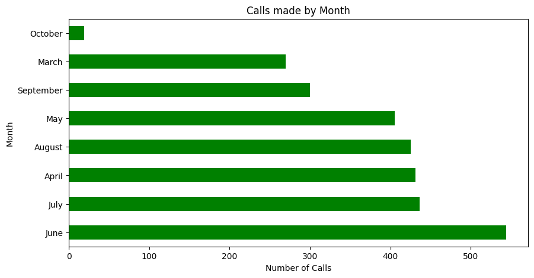
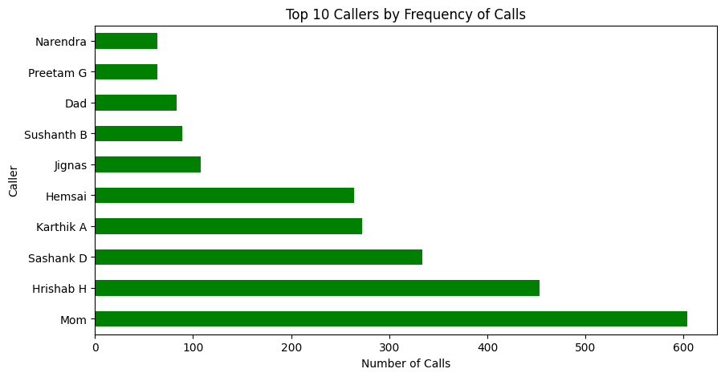
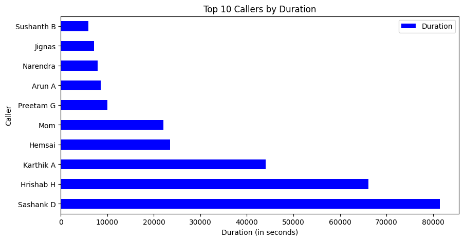
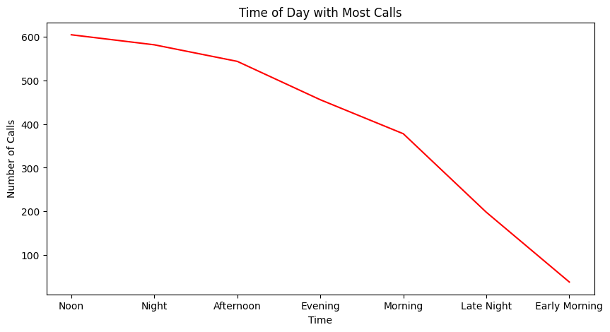
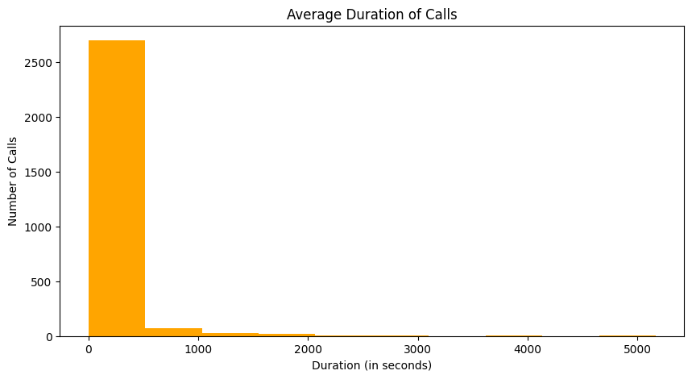
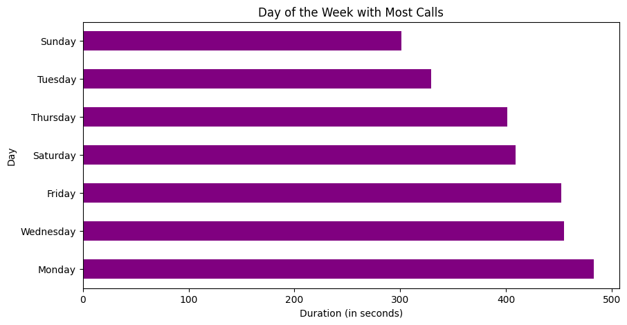
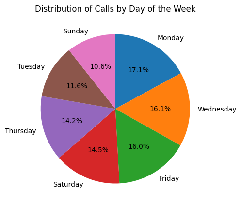

# Call Data Analysis
This repository contains a collection of scripts and notebooks for analyzing call data. The call data is collected from a phone using an app named [SMS Backup and Restore](https://play.google.com/store/apps/details?id=com.riteshsahu.SMSBackupRestore) and exported to an XML file. The XML file can be converted to a CSV file using call_analysis_functions.py file by 'xml_to_csv' function in it.

Once the call data is in CSV format, it can be analyzed using a variety of tools and techniques. For example, you can use the data to answer the following questions:

* Number of calls made by month
 
June month has the highest number of calls: **544 calls**
* Top 10 callers by Frequency of Calls.
 
Mom (understandably) is the highest caller: **604 calls**
* Top 10 Callers by Duration
 
Sashank D is the most I've wasted my time on: **81513 seconds**
* Time of the day with most calls.
 
I've spent most of my Noon talking: **605 calls**
* Average Duration of Calls.
 
My average talktime is **108 seconds** :)
* Day of the Week with Most Calls
 
Monday (understandably, since I have to beg my friends to attend college) is the day I talk the most: **483 calls**
* Distribution of Calls by Day of the Week.
 
* This data can also be used to make informed decisions about your mobile plan. For example, if you have taken a 3-month unlimited talktime plan and you talk way less than you pay, you might reconsider after viewing it. Of course the plan also include other things like x data per day and x SMS per day so definitely take the decision based on your needs.
* For this qustion, I currently don't know the charge per minute (rupee/min) for my carrier. I've contacted them, so I'll update it when I get a reply from them.

## Privacy

The call data in this repository has been anonymized for privacy reasons. The contact numbers and names have been changed, but the rest of the data is the same.

## How to use

To use this repository, follow these steps:

1. Clone the repository to your local machine.
2. Install the required Python libraries using `pip install pandas matplotlib` _Assuming you have Jupyter installed_.
3. Convert the XML file to CSV file using given function.
4. Open 'call_data_analysis.ipynb' and update the paths of the file.
5. Run the notebook and see your data.

## Further implementations

This repository can be extended to support additional features, such as:

* Identifying patterns in call data, such as frequent callers or times of day when you are most likely to be called.
* Predicting future call patterns.
* Integrating with other data sources, such as your calendar or contact list, to provide more insights into your calling habits.

## Contributions

Contributions to this repository are welcome. Please feel free to submit pull requests with new features, bug fixes, or documentation improvements.
